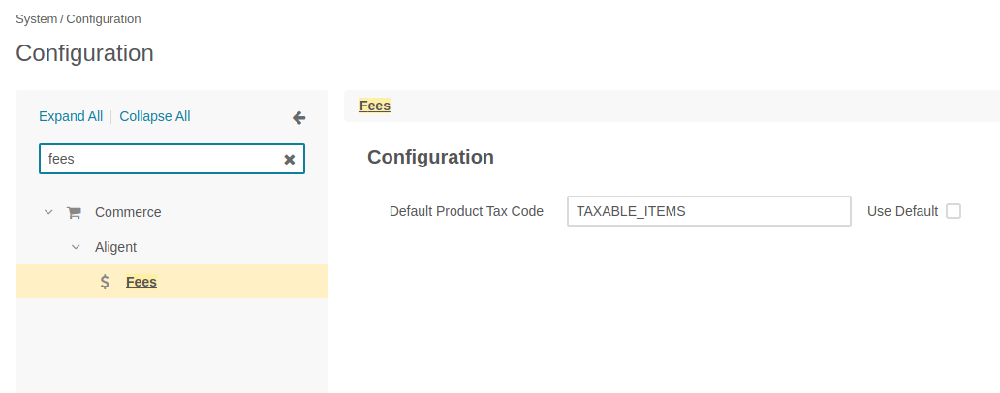

Aligent Fees Bundle
==============================
This Bundle adds the ability to dynamically inject 'fees' as new Line Items into the Checkout process.

For example, if a 'Handling Fee' is to be charged for orders under $100.

This Bundle takes advantage of OroCommerce's 'Freeform LineItem' feature,
where a LineItem can be added to the Checkout without being linked to a Product.

Requirements
-------------------
- OroCommerce 5.0

Important Notes/Caveats
-------------------
* The Line Item which is added to the cart is _not_ a real product.
  We utilize the 'FreeForm Line Item' feature in Oro Checkouts.
  This allows the price and description to be set by the fee itself,
  and avoids any possible inventory issues.
* The process for placing a new Order (**ShoppingList => Checkout => Order**)
  is slightly different to the process for Re-Ordering an
  existing Order (**Order => Checkout => Order**).
  As a result, our `CreateCheckoutListener` is required to
  manually persist/flush the Checkout so that the new line item is saved.

Installation and Usage
-------------------
**NOTE: Adjust instructions as needed for your local environment**

### Installation
*Currently, this Bundle is not available via Composer and must be installed manually into the application*

Once installed, clear Oro cache to load bundle.

### Configuration
1. Login to the Oro Admin
2. Visit **System Configuration => Commerce => Aligent => Fees** (or the Website-specific equivalent)
3. Set the **Default Product Tax Code**



Note: This Tax Code will apply to the Fee itself.
Oro does not apply taxes to FreeForm Line Items, this configuration is used by
our `ContextHandler\FreeFormAwareTaxOrderLineItemHandler` to apply the correct tax.

Database Modifications
-------------------
*This Bundle does not directly modify the database schema in any way*

All configuration is stored in System Configuration (`oro_config_value`).


### Adding and Registering new Fees
1. Create a new Bundle (or use an existing one as needed)
1. Create a new class for the fee (eg `MyBundle\Fee\HandlingFeeProvider`).
   This new class should extend `Aligent\FeesBundle\Fee\AbstractLineItemFee`.
1. Define a new service for the new fee, and add it to the fee registry:
    ```yaml
    services:
        Acme\MyBundle\Fee\HandlingFeeProvider:
            parent: '@Aligent\FeesBundle\Fee\Provider\AbstractLineItemFeeProvider'
            tags:
                - { name: aligent_fees.fee_provider, priority: 0 }
    ```

1. Create a new Fee Provider Class and implement the applicable methods:

    ```php
    <?php
    namespace Acme\MyBundle\Fee\Provider;
    
    use Aligent\FeesBundle\Fee\AbstractLineItemFeeProvider;
    use Oro\Bundle\CheckoutBundle\Entity\Checkout;
    
    class HandlingFeeProvider extends AbstractLineItemFeeProvider
    {
       const NAME = 'fees.handling_fee';
       const TYPE = 'handling_fee';
       const LABEL = 'acme.my_bundle.fees.handling_fee.label';
       const SKU = 'HF001'; // Shouldn't be a real product
       const AMOUNT = 10.00;
    
        /**
         * Get Fee name
         * @return string
         */
        public function getName(): string
        {
            return self::NAME;
        }
    
        /**
         * Return label key
         * @return string
         */
        public function getLabel(): string
        {
            return $this->translator->trans(self::LABEL);
        }
    
        /**
         * Return SKU of Fee
         * @return null|string
         */
        public function getSKU(): ?string
        {
            return self::SKU;
        }
    
        /**
         * @param Checkout $checkout
         * @return float|null
         */
        public function getAmount(Checkout $checkout): ?float
        {
            return self::AMOUNT;
        }
    
        /**
         * Is the fee Applicable to this Checkout?
         * @param Checkout $checkout
         * @return bool
         */
        public function isApplicable(Checkout $checkout): bool
        {
            return true;
        }
    }
    ```

Noteworthy Features
-------------------
*Where to look first if something goes wrong*

* Method `EventListener\CreateCheckoutListener::onStartCheckoutConditionCheck()` injects Fees into the current Checkout as new LineItems.
* Method `Fee\AbstractFee::getCheckoutLineItem()` builds and generates the Fee Freeform LineItem, including Price/Currency/SKU/Unit/etc.

Core Overrides & Extensions
-------------------
* Class `ContextHandler\FreeFormAwareTaxOrderLineItemHandler` decorates the core Oro `\Oro\Bundle\TaxBundle\OrderTax\ContextHandler\OrderLineItemHandler` class so that it can support Tax calculations for Freeform Line Items.


Roadmap / Remaining Tasks
-------------------
- [x] OroCommerce 5.0 Support
- [x] Implement Unit Tests
- [ ] Complete adding support for Fees added as Subtotals
- [ ] Add Native Support for Payment Processing Fees
- [ ] Re-implement support for line item messaging
- [ ] Convert Product Tax Code Configuration into Select field
- [ ] (TBC) Add support for Expression Language
