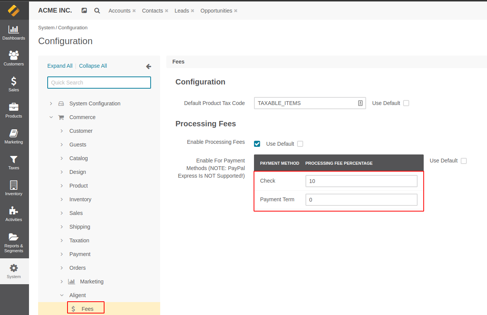
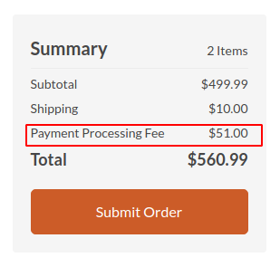

Aligent OroCommerce Fees Bundle
==============================
This Bundle adds the ability to dynamically inject 'fees' as new Line Items into the Checkout process.

For example, if a 'Handling Fee' is to be charged for orders under $100.

This Bundle takes advantage of OroCommerce's 'Freeform LineItem' feature,
where a LineItem can be added to the Checkout without being linked to a Product.

Requirements
-------------------
- OroCommerce 5.0

Important Notes/Caveats
-------------------
* This bundle currently only adds a Payment Processing Fee, any other Fees must be implemented manually
  using the provided Abstract classes/interfaces.
* The Line Item which is added to the cart is _not_ a real product.
  We utilize the 'FreeForm Line Item' feature in Oro Checkouts.
  This allows the price and description to be set by the fee itself,
  and avoids any possible inventory/visibility issues.
* The process for placing a new Order (**ShoppingList => Checkout => Order**)
  is slightly different to the process for Re-Ordering an
  existing Order (**Order => Checkout => Order**).
  As a result, our `CreateCheckoutListener` is required to
  manually persist/flush the Checkout so that the new line item is saved.

Installation and Usage
-------------------
**NOTE: Adjust instructions as needed for your local environment**

### Installation
Install via Composer
```shell
composer require aligent/orocommerce-fees-bundle
```

Once installed, run platform update to perform the installation:
```shell
php bin/console oro:platform:update --env=prod
```

### Configuration
1. Login to the Oro Admin
2. Visit **System Configuration => Commerce => Aligent => Fees** (or the Website-specific equivalent)
3. Set the **Default Product Tax Code**


Note: This Tax Code will apply to the Fee itself.
Oro does not apply taxes to FreeForm Line Items, this configuration is used by
our `ContextHandler\FreeFormAwareTaxOrderLineItemHandler` to apply the correct tax.

Database Modifications
-------------------
* Adds a new `processing_fee` column to the `oro_order` database table (and extends the Oro `Order` entity)

All configuration is stored in System Configuration (`oro_config_value`).

### Payment Processing Fees
This feature allows OroCommerce to charge an additional percentage for payments made via specific methods.

The percentage can be configured on a per-Method basis, eg:
* 1.5% fee for VISA/MasterCard Credit Card Payments
* 2.0% fee for AMEX Credit Card Payments

After installation, visit the System Configuration (or Website Configuration to configure on a per-Website scope).

Each Payment Method will be visible here. Set the Percentage to a value above `0` to charge a processing fee for that method:



If the Customer chooses that method during the Checkout, a processing fee will be calculated and add to the Subtotals:



**NOTE: Processing Fees are not currently support by PayPal Express as they are not included in the Subtotal, which causes a payment validation error**

### Adding and Registering new Custom Fees
1. Create a new Bundle (or use an existing one as needed)
1. Create a new class for the fee (eg `MyBundle\Fee\HandlingFeeProvider`).
   This new class should extend `Aligent\FeesBundle\Fee\AbstractLineItemFee`.
1. Define a new service for the new fee, and add it to the fee registry:
    ```yaml
    services:
        Acme\MyBundle\Fee\HandlingFeeProvider:
            parent: '@Aligent\FeesBundle\Fee\Provider\AbstractLineItemFeeProvider'
            tags:
                - { name: aligent_fees.fee_provider, priority: 0 }
    ```

1. Create a new Fee Provider Class and implement the applicable methods:

    ```php
    <?php
    namespace Acme\MyBundle\Fee\Provider;
    
    use Aligent\FeesBundle\Fee\AbstractLineItemFeeProvider;
    use Oro\Bundle\CheckoutBundle\Entity\Checkout;
    
    class HandlingFeeProvider extends AbstractLineItemFeeProvider
    {
       const NAME = 'fees.handling_fee';
       const TYPE = 'handling_fee';
       const LABEL = 'acme.my_bundle.fees.handling_fee.label';
       const SKU = 'HF001'; // Shouldn't be a real product
       const AMOUNT = 10.00;
    
        /**
         * Get Fee name
         * @return string
         */
        public function getName(): string
        {
            return self::NAME;
        }
    
        /**
         * Return label key
         * @return string
         */
        public function getLabel(): string
        {
            return $this->translator->trans(self::LABEL);
        }
    
        /**
         * Return SKU of Fee
         * @return null|string
         */
        public function getSKU(): ?string
        {
            return self::SKU;
        }
    
        /**
         * @param Checkout $checkout
         * @return float|null
         */
        public function getAmount(Checkout $checkout): ?float
        {
            return self::AMOUNT;
        }
    
        /**
         * Is the fee Supported by this Entity?
         * @param mixed $entity
         * @return bool
         */
        public function isSupported($entity): bool
        {
            return ($entity instanceof Checkout);
        }
    }
    ```

Noteworthy Features
-------------------
*Where to look first if something goes wrong*

* Method `EventListener\CreateCheckoutListener::onStartCheckoutConditionCheck()` injects Fees into the current Checkout as new LineItems.
* Method `Fee\AbstractFee::getCheckoutLineItem()` builds and generates the Fee Freeform LineItem, including Price/Currency/SKU/Unit/etc.

Core Overrides & Extensions
-------------------
* Class `ContextHandler\FreeFormAwareTaxOrderLineItemHandler` decorates the core Oro `\Oro\Bundle\TaxBundle\OrderTax\ContextHandler\OrderLineItemHandler` class so that it can support Tax calculations for Freeform Line Items.


Roadmap / Remaining Tasks
-------------------
- [x] OroCommerce 5.0 Support
- [x] Implement Unit Tests
- [x] Complete adding support for Fees added as Subtotals
- [x] Add Native Support for Payment Processing Fees
- [ ] Add support for PayPal Express Processing Fees
- [ ] Re-implement support for line item messaging
- [ ] Convert Product Tax Code Configuration into Select field
- [ ] More fine-grained control over Processing Fees (eg exclude certain Customer Groups from being charged fee)
- [ ] (TBC) Add support for Expression Language
